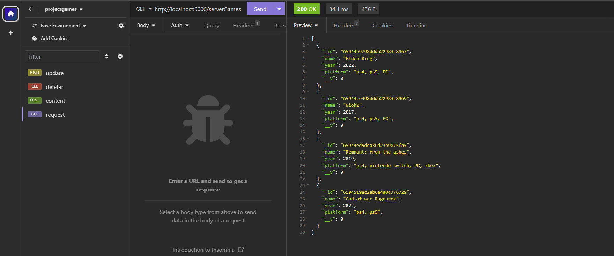
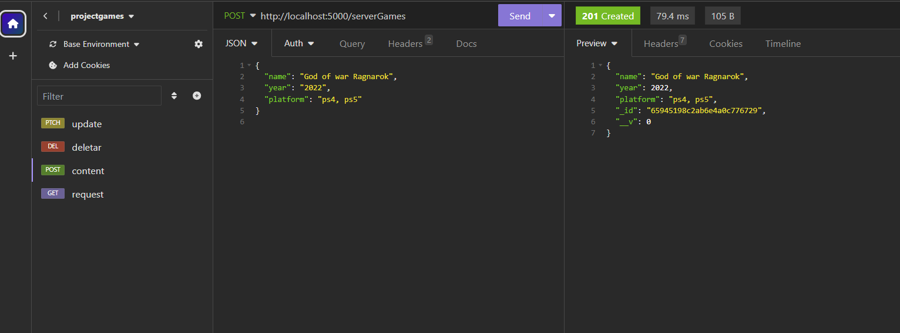
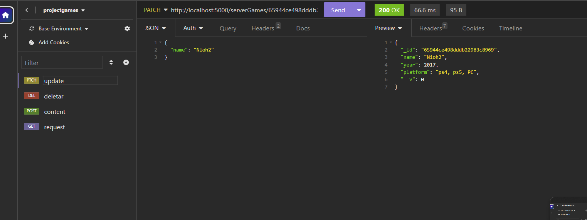
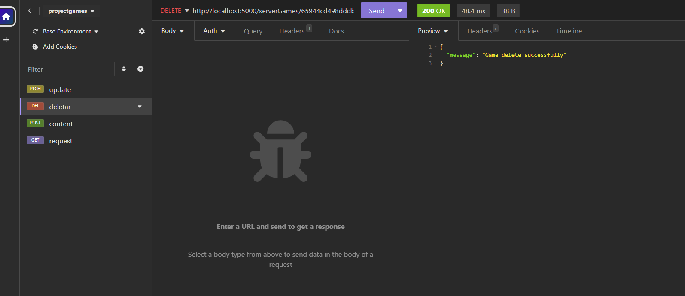

# [Projeto GamesAPI](https://back-endapi-pvw0.onrender.com/serverGames)

Exercício proposto no curso Programaria Back-End | Minha primeira API

#

API conectada ao MongoDB que gera requisições de jogos favoritos

### Testes feitos no Insomnia

Utilizei os métodos do HTTP que foram aprendidos durante o curso:
- GET: solicitação a URL dos dados de um servidor 

- POST: método que envia dados ao servidor no corpo da requisição. Nesse projeto, criei um model de solicitação de dados (como nome, ano de lançamento do jogo e plataformas) para envio ao MongoDB 
- PATCH: permite fazer atualizações de alguns dados de requisições, utilizando a id do objeto criado no banco de dados. 
- DELET: exclui dados de um ID de requisições feitas ao  

#

Apliquei proteção de dados do Mongo por meio do .env

#### Tecnologias utilizadas:
- JavaScript
- Node.js
- MongoDB
- Render <https://back-endapi-pvw0.onrender.com/serverGames>

